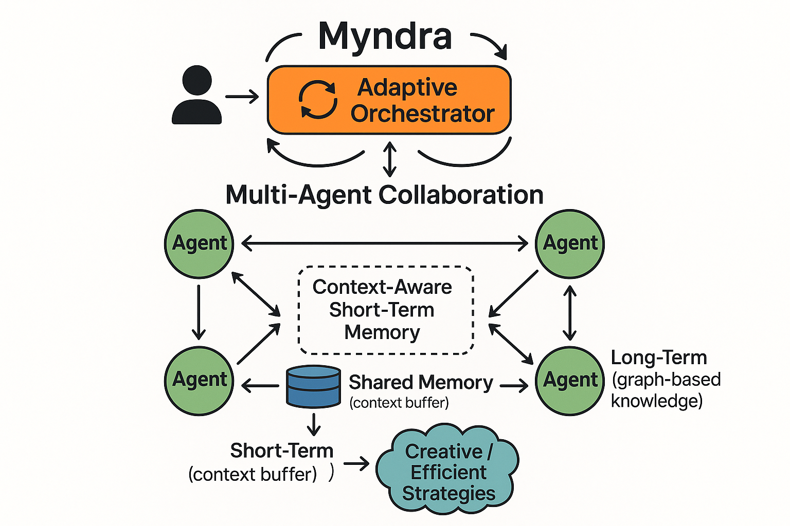

# Myndra: Multi-Agent Orchestration Framework



> **Current Development Focus:** Memory Module & Testing (August 2025)

## Overview

Myndra is a Multi-Agent Reinforcement Learning (MARL) orchestration framework designed for dynamic, human-like AI collaboration. Unlike existing systems with static agent roles and rigid workflows, Myndra introduces a novel adaptive orchestrator that can modify the agent team composition, interaction order, and responsibilities in real time.

## What is MARL?

Multi-Agent Reinforcement Learning (MARL) studies how multiple learning agents act and learn concurrently in a shared environment. Each agent optimizes its policy via rewards while coordinating, competing, or cooperating with others.

In Myndra:
- **Agents** learn and adapt behaviors from feedback and shared memory.
- **Orchestrator** coordinates agent roles and interaction order to optimize team performance.
- **Memory** (episodic + long-term knowledge graph) provides context for better credit assignment and decision-making.
- **Objectives** can be cooperative, competitive, or mixed, depending on the task design.

## Key Features

- **Adaptive Orchestration:** Dynamically modifies agent team composition and workflows
- **Moldable Agents:** Agents evolve behavior based on shared memory and feedback
- **Structured Memory Architecture:** Combines long-term graph-based knowledge with context-aware short-term memory
- **Human-in-the-Loop:** Enables humans to participate as agents or intervene in orchestration

## Project Structure

```
├── agents/             # Agent definitions and behaviors
├── interface/          # User interaction components
├── memory/             # Memory architecture (current focus)
│   ├── memory_module.py  # Core memory implementation
│   ├── memory_tests.py   # Testing suite (in development)
│   └── memory_types.py   # Type definitions (in development)
├── orchestrator/       # Orchestration logic
└── main.py             # Application entry point
```

## Memory Architecture

The memory system is the core of Myndra's adaptive capabilities, consisting of:

1. **EpisodicMemory (Short-term):** Per-agent rolling buffer of recent experiences
2. **KnowledgeGraph (Long-term):** Content-centric directed graph for semantic relationships
3. **SharedMemory:** Unified interface combining both memory types

## Memory Semantics

The memory APIs behave as follows (see `memory/memory_module.py`):

- **EpisodicMemory**
  - Stores per-agent events as dicts: `{"timestamp", "agent_id", "content"}`.
  - `strict_mode=True`: `get_recent()` raises `KeyError` for unknown agents.

- **KnowledgeGraph**
  - `add_node(agent_id, content, context=None, ...)` adds normalized text nodes and creates an edge `context -> content` when context is provided.
  - `get_related(node, depth)` performs BFS over predecessors and returns a list of edge dicts: `{ "src": node, "dst": predecessor }`.

- **SharedMemory**
  - `write(agent_id, content, context=None)` prefixes agent IDs, writes to episodic, adds KG nodes/edges, and links `task -> content` when `task\d+` is detected.
  - `get_recent(agent_id, n)` returns a list of episodic event dicts for that agent.
  - `retrieve(agent_id, query)` returns a list of dicts with `{"content": str}` from hybrid episodic + KG search.

## Development Timeline

| Date | Milestone |
|------|----------|
| June 2025 | Initial architecture design |
| July 2025 | Core agent implementation |
| **August 2025** | **Memory module development & testing** |
| September 2025 (Planned) | Orchestrator implementation |
| October 2025 (Planned) | Interface development |
| November 2025 (Planned) | Integration testing |
| December 2025 (Planned) | Initial release |

## Current Focus: Memory Testing

We are currently developing the testing suite for the memory module to ensure:

- Proper storage and retrieval of episodic memories
- Accurate knowledge graph construction and traversal
- Efficient memory decay and relevance scoring
- Thread-safe concurrent memory access

## Getting Started

```bash
# Clone the repository
git clone https://github.com/ysham123/Myndra.git

# Install dependencies
pip install -r requirements.txt

# Run tests
pytest -v
```

## Contributing

Contributions are welcome! Please feel free to submit a Pull Request.

## License

This project is licensed under the MIT License - see the LICENSE file for details.
