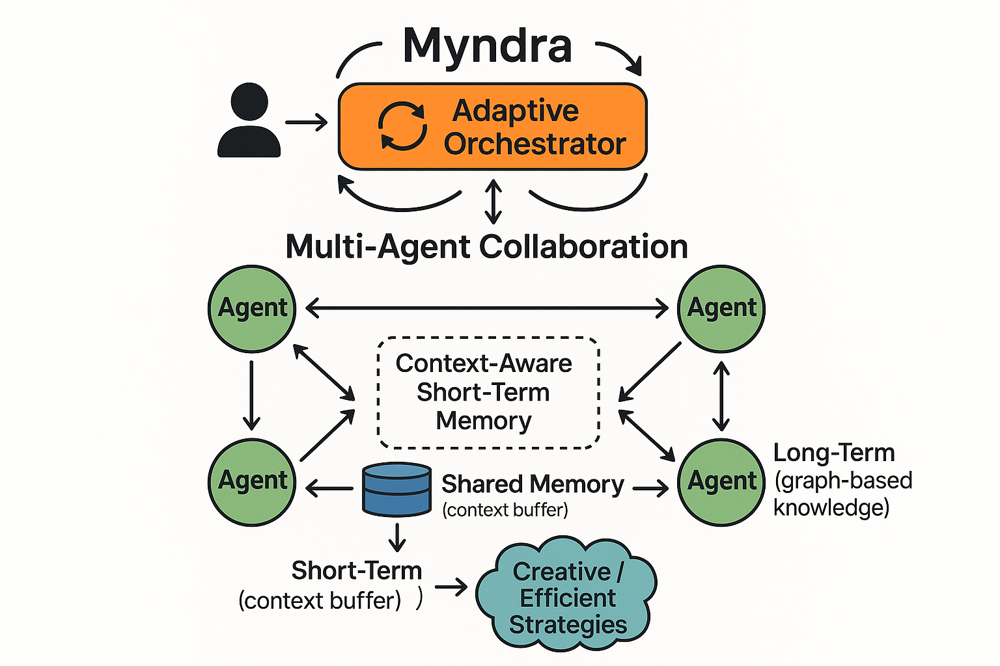

# Myndra: Multi-Agent Orchestration Framework



> **Current Development Focus:** Memory Module & Testing (August 2025)

## Overview

Myndra is a Multi-Agent Reinforcement Learning (MARL) orchestration framework designed for dynamic, human-like AI collaboration. Unlike existing systems with static agent roles and rigid workflows, Myndra introduces a novel adaptive orchestrator that can modify the agent team composition, interaction order, and responsibilities in real time.

## What is MARL?

Multi-Agent Reinforcement Learning (MARL) studies how multiple learning agents act and learn concurrently in a shared environment. Each agent optimizes its policy via rewards while coordinating, competing, or cooperating with others.

In Myndra:
- **Agents** learn and adapt behaviors from feedback and shared memory.
- **Orchestrator** coordinates agent roles and interaction order to optimize team performance.
- **Memory** (episodic + long-term knowledge graph) provides context for better credit assignment and decision-making.
- **Objectives** can be cooperative, competitive, or mixed, depending on the task design.

## Key Features

- **Adaptive Orchestration:** Dynamically modifies agent team composition and workflows
- **Moldable Agents:** Agents evolve behavior based on shared memory and feedback
- **Structured Memory Architecture:** Combines long-term graph-based knowledge with context-aware short-term memory
- **Human-in-the-Loop:** Enables humans to participate as agents or intervene in orchestration

## Project Structure

```
├── agents/             # Agent definitions and behaviors
├── interface/          # User interaction components
├── memory/             # Memory architecture (current focus)
│   ├── memory_module.py  # Core memory implementation
│   ├── memory_tests.py   # Testing suite (in development)
│   └── memory_types.py   # Type definitions (in development)
├── orchestrator/       # Orchestration logic
└── main.py             # Application entry point
```

## Memory Architecture

The memory system is the core of Myndra's adaptive capabilities, consisting of:

1. **EpisodicMemory (Short-term):** Per-agent rolling buffer of recent experiences
2. **KnowledgeGraph (Long-term):** Content-centric directed graph for semantic relationships
3. **SharedMemory:** Unified interface combining both memory types

## Memory Semantics

The memory APIs behave as follows (see `memory/memory_module.py`):

- **EpisodicMemory**
  - Stores per-agent events as dicts: `{"timestamp", "agent_id", "content"}`.
  - `strict_mode=True`: `get_recent()` raises `KeyError` for unknown agents.

- **KnowledgeGraph**
  - `add_node(agent_id, content, context=None, ...)` adds normalized text nodes and creates an edge `context -> content` when context is provided.
  - `get_related(node, depth)` performs BFS over predecessors and returns a list of edge dicts: `{ "src": node, "dst": predecessor }`.

- **SharedMemory**
  - `write(agent_id, content, context=None)` prefixes agent IDs, writes to episodic, adds KG nodes/edges, and links `task -> content` when `task\d+` is detected.
  - `get_recent(agent_id, n)` returns a list of episodic event dicts for that agent.
  - `retrieve(agent_id, query)` returns a list of dicts with `{"content": str}` from hybrid episodic + KG search.

## Development Timeline

| Date | Milestone |
|------|----------|
| June 2025 | Initial architecture design |
| July 2025 | Core agent implementation |
| **August 2025** | **Memory module development & testing** |
| September 2025 (Planned) | Orchestrator implementation |
| October 2025 (Planned) | Interface development |
| November 2025 (Planned) | Integration testing |
| December 2025 (Planned) | Initial release |

## Current Focus: Memory Testing

We are currently developing the testing suite for the memory module to ensure:

- Proper storage and retrieval of episodic memories
- Accurate knowledge graph construction and traversal
- Efficient memory decay and relevance scoring
- Thread-safe concurrent memory access

## Getting Started

```bash
# Clone the repository
git clone https://github.com/ysham123/Myndra.git

# Install dependencies
pip install -r requirements.txt

# Run tests
pytest -v
```

---

## Authorship & Research Ownership
Myndra is an open‑source research framework originally conceived, architected, and developed by **Yosef Shammout** (Computer Science, Wayne State University).  
Yosef serves as the primary author and research lead on Myndra’s design, orchestration logic, and agent‑memory architecture.

While Myndra welcomes community contributions under the MIT license, all core conceptual, architectural, and research work should be attributed to **Yosef Shammout** in academic, research, or technical references.

## Contributing

Contributions are welcome! Please feel free to submit a Pull Request.

## License

This project is licensed under the MIT License - see the LICENSE file for details.

# Myndra: Multi‑Agent Orchestration Framework


> **Current Development Focus (Oct 2025): Orchestrator + LLM Planner (v1.1)**

Myndra is a multi‑agent orchestration framework designed for adaptive, human‑in‑the‑loop collaboration. The orchestrator plans a set of subtasks, assigns them to agents, executes them, and summarizes outcomes. Agents are *moldable*: they can adapt behavior based on shared memory and feedback.

---

## TL;DR (Status)
- ✅ **v1.1 running**: Orchestrator + LLM Planner integrated, assignment + execution + summarization stable.
- 🧠 **Planner model**: defaults to `gpt-5-mini` (fast & cost‑efficient). You can opt‑in to `gpt-5` for deeper reasoning.
- 🧱 **Agents available**: `AnalystAgent`, `GeneralAgent` (used as planner/executor/summarizer roles via registry).
- 🗃️ **Memory**: core shared memory API in place; basic retrieval working; advanced tests in progress.
- 🔁 **Fallback**: deterministic planner available if LLM is disabled.

Road to **v1.2**: add EvaluatorAgent (auto‑grading), richer memory retrieval, first domain adapter (radiology demo).  
Road to **v2.0 (research‑ready)**: rigorous evaluation harness, dataset adapters (DICOM/CSV), reliability guardrails.

---

## Why Myndra
Existing systems often use fixed agent roles and rigid workflows. Myndra’s orchestrator **adapts team composition and interaction order at runtime**, enabling:
- Dynamic task decomposition & role assignment
- Feedback‑driven behavior shaping ("moldable agents")
- Hybrid memory (episodic + long‑term knowledge graph)
- Human‑in‑the‑loop interventions

---

## Architecture

- **Orchestrator**: plans → assigns → executes → summarizes; swaps models dynamically based on task complexity.
- **Agents**: modular, stateful workers registered by name (e.g., `analyst`, `planner`, `executor`, `general`).
- **Memory**: short‑term episodic buffer + long‑term knowledge graph with a unified interface.

```
├── agents/
│   ├── analyst_agent.py
│   ├── general_agent.py
│   ├── agent_registry.py
│   └── __init__.py
├── memory/
│   ├── memory_module.py
│   ├── memory_types.py
│   └── memory_tests.py
├── orchestrator/
│   ├── orchestrator.py
│   ├── planner.py          # LLM & deterministic planners
│   └── __init__.py
├── interface/
├── main.py
└── README.md
```

---

## Quickstart

### 1) Install
```bash
python -m venv venv && source venv/bin/activate
pip install -r requirements.txt
```

### 2) Configure
Set your API key and opt‑in to the LLM planner (optional, but recommended):
```bash
export OPENAI_API_KEY=your_key_here
export MYNDRA_USE_LLM=1
# Optional: pick a planner model (defaults to gpt-5-mini)
export MYNDRA_PLANNER_MODEL=gpt-5-mini   # or: gpt-5
```
> **Note:** Some models (e.g., `gpt-5-mini`) only allow the default temperature. Do **not** override `temperature` unless the model supports it.

### 3) Run
```bash
python3 main.py
```
You should see: goal → planned subtasks → assignments → execution results → final summary.

---

## Configuration

Environment variables used by Myndra:

| Variable | Purpose | Example |
|---|---|---|
| `OPENAI_API_KEY` | LLM access | `sk-...` |
| `MYNDRA_USE_LLM` | Enable LLM planner (1/0) | `1` |
| `MYNDRA_PLANNER_MODEL` | Planner model | `gpt-5-mini` / `gpt-5` |

**Model guidance:**
- `gpt-5-mini` — fast, cost‑efficient default for most orchestration.
- `gpt-5` — use for complex research tasks or domain‑heavy planning.
- `gpt-5-nano` — high‑throughput simple tasks (rarely needed for planning).

> Mapping (System Card → API): `gpt-5-thinking` → `gpt-5`, `gpt-5-thinking-mini` → `gpt-5-mini`, `gpt-5-thinking-nano` → `gpt-5-nano`.

---

## Usage Examples

### Basic goal
```text
Goal: Analyze performance metrics
```
Expected run:
- LLM planner generates 10–15 subtasks
- Orchestrator assigns tasks to `analyst`/`planner`/`executor`/`general`
- Agents execute; summarizer produces a final report

### Radiology demo (optional adapter)
```text
Goal: Analyze chest X‑ray dataset for QA signals and error patterns
```
Planner (with `gpt-5`) will propose: dataset ingestion, preprocessing, baseline metrics, error taxonomy, cross‑modality checks, and reporting.  
> **Disclaimer:** Myndra is an orchestration research framework; it is **not** a medical device and should not be used for clinical decisions.

---

## What’s New in v1.1
- ✨ **LLM Planner integration** (`planner.py`): `gpt-5-mini` by default; opt‑in to `gpt-5`.
- 🧩 **Agent Registry** (`agent_registry.py`): stable names → concrete classes.
- 🧠 **Memory write/retrieve** path wired into agents (basic usage).
- 🧪 **Deterministic fallback** planner when `MYNDRA_USE_LLM=0`.
- 📝 **Run logs** with per‑task confidence & adaptation summary.

---

## Roadmap

### v1.2
- EvaluatorAgent for auto‑grading and run‑time critiques
- Improved memory retrieval scoring & decay
- Domain adapters (radiology image QA, structured tabular analytics)

### v2.0 (Research‑ready)
- Evaluation harness (reproducible seeds, datasets, metrics)
- Dataset adapters: DICOM/CSV/JSON; de‑identification utilities
- Reliability guardrails (self‑check, re‑plan on failure, timeouts)
- Paper/tech report draft with ablations

---

## Testing
```bash
pytest -v
```
Focus areas:
- Episodic/graph memory correctness
- Planner output schema and assignment mapping
- Orchestrator execution + summarization flow

---

## Troubleshooting
- **`Unknown agent name`** → ensure the agent key exists in `agent_registry.py`.
- **`ModuleNotFoundError: agents.general_agent`** → verify file path/names.
- **`unsupported_value: temperature`** → don’t pass `temperature` to models that only support defaults (e.g., `gpt-5-mini`).
- **No plan when LLM enabled** → check `OPENAI_API_KEY` and `MYNDRA_USE_LLM=1`.

---

## Contributing
PRs welcome! Please discuss large proposals in an issue first.

## License
MIT — see `LICENSE`.